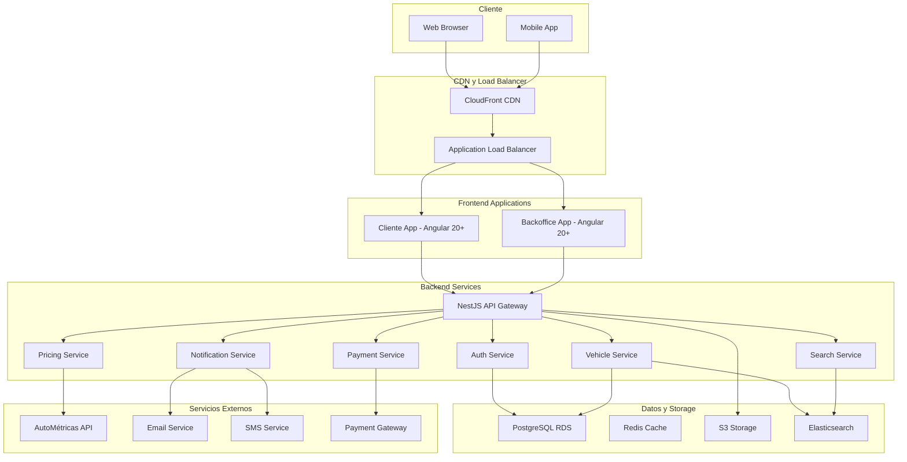

# General Architecture

## Visión Arquitectural

La plataforma Carvento está diseñada como un ecosistema digital modular y escalable que facilita la venta de vehículos usados mediante un marketplace directo similar a KAVAK. La arquitectura se basa en principios de microservicios, separación de responsabilidades y alta disponibilidad, diseñada para manejar alto volumen de listados, búsquedas eficientes y transacciones seguras.

## Principios Arquitecturales

### 1. Separación de Responsabilidades (Separation of Concerns)
- **Frontend Público**: Interfaz para búsqueda y visualización de vehículos
- **Backoffice**: Panel administrativo para gestión de inventario y ventas
- **API Backend**: Lógica de negocio centralizada para marketplace
- **Servicios Externos**: Integración con AutoMétricas y servicios de pago

### 2. Escalabilidad y Rendimiento
- **Arquitectura Cloud-Native**: Diseñada para AWS Fargate
- **Caching Multi-Nivel**: Redis para sesiones, CloudFront para assets
- **Base de Datos Optimizada**: PostgreSQL con indexación estratégica para búsquedas
- **Search Engine**: Elasticsearch para búsquedas complejas de vehículos

### 3. Seguridad por Capas
- **Autenticación Segura**: JWT con refresh tokens
- **Autorización por Roles**: RBAC para vendedores, compradores y admins
- **Encriptación**: TLS 1.3, datos en reposo encriptados
- **Protección de Pagos**: Integración segura con procesadores de pago

## Arquitectura de Alto Nivel



## Stack Tecnológico Seleccionado

### Frontend
**Tecnología**: Angular 20+ con Nx Monorepo

**Justificación**:
- **Signals**: Reactivity moderna ideal para búsquedas y filtros en tiempo real
- **Standalone Components**: Mejor tree-shaking para aplicaciones de marketplace
- **Control Flow Nuevo**: @if, @for, @switch para renderizado eficiente de listados
- **PrimeNG 20+**: Componentes empresariales para interfaces de e-commerce
- **Nx Monorepo**: Compartir código entre cliente y backoffice, optimización de builds

**Arquitectura de Frontend**:
```
apps/
├── marketplace/          # App pública para búsqueda y visualización
├── backoffice/          # Panel administrativo para vendedores y admins
└── api/                 # NestJS backend

libs/
├── shared-ui/           # Componentes UI reutilizables
├── shared-types/        # Interfaces TypeScript
├── shared-utils/        # Utilidades comunes
├── search-engine/       # Lógica de búsqueda avanzada
└── domain-models/       # Modelos de dominio
```

### Backend
**Tecnología**: NestJS con TypeScript

**Justificación**:
- **Decorators & DI**: Código más limpio y testeable
- **OpenAPI Integration**: Documentación automática de APIs
- **Performance**: Ideal para APIs de alto volumen con caching
- **Modular Architecture**: Cada dominio como módulo independiente
- **TypeORM**: ORM robusto para PostgreSQL con migraciones

**Estructura Modular**:
```
src/
├── modules/
│   ├── auth/             # Autenticación y autorización
│   ├── vehicles/         # Gestión de vehículos e inventario
│   ├── search/           # Motor de búsqueda avanzada
│   ├── users/            # Gestión de usuarios
│   ├── pricing/          # Cálculo de precios y valoración
│   ├── payments/         # Procesamiento de pagos
│   ├── leads/            # Gestión de leads e interesados
│   └── notifications/    # Sistema de notificaciones
├── common/
│   ├── guards/           # Guards de autenticación
│   ├── interceptors/     # HTTP interceptors
│   ├── filters/          # Exception filters
│   └── decorators/       # Custom decorators
└── shared/
    ├── entities/         # Entidades de base de datos
    ├── dtos/             # Data Transfer Objects
    └── interfaces/       # Interfaces comunes
```

## Componentes Arquitecturales Principales

### 1. API Gateway (NestJS)
**Responsabilidades**:
- Punto único de entrada para todas las requests del marketplace
- Autenticación y autorización centralizada
- Rate limiting y throttling para proteger APIs
- Request/response logging y monitoring
- Routing a servicios específicos (vehículos, búsqueda, pagos)

**Justificación de Diseño**:
- **Centralización**: Un solo punto para aplicar políticas de seguridad
- **Escalabilidad**: Fácil adición de nuevos endpoints para funcionalidades
- **Monitoring**: Observabilidad centralizada del marketplace
- **Versionado**: Control de versiones de API para evolución

### 2. Módulo de Autenticación
**Arquitectura JWT con Refresh Tokens**:
```typescript
interface AuthTokens {
  accessToken: string;    // 15 minutos de vida
  refreshToken: string;   // 7 días de vida
  role: UserRole;
  permissions: Permission[];
}
```

**Justificación**:
- **Seguridad**: Tokens de corta duración minimizan riesgo
- **UX**: Refresh automático sin re-login para navegación fluida
- **Escalabilidad**: Stateless, no sesiones en servidor
- **Roles Específicos**: Diferenciación clara entre compradores, vendedores y admins

### 3. Motor de Búsqueda Avanzada
**Arquitectura Elasticsearch + PostgreSQL**:
```typescript
@Injectable()
export class SearchService {
  async searchVehicles(query: SearchQuery): Promise<SearchResult> {
    // Búsqueda en Elasticsearch para filtros complejos
    const esResults = await this.elasticsearch.search({
      index: 'vehicles',
      body: this.buildElasticsearchQuery(query)
    });

    // Enriquecimiento de datos desde PostgreSQL
    return this.enrichWithRelationalData(esResults);
  }
}
```

**Justificación**:
- **Performance**: Elasticsearch para búsquedas complejas y facetadas
- **Flexibilidad**: Filtros avanzados por múltiples criterios
- **Escalabilidad**: Índices distribuidos para grandes volúmenes
- **Relevancia**: Scoring personalizado para resultados óptimos

### 4. Gestión de Medios (Fotos/Documentos)
**Arquitectura S3 + CloudFront**:
```
Flujo de Upload:
Cliente → Signed URL → S3 Direct Upload → Metadata a DB → CloudFront Cache
```

**Justificación**:
- **Performance**: Upload directo a S3, no pasa por API
- **Costo**: CloudFront cache reduce transferencia
- **Seguridad**: Signed URLs con expiración
- **Escalabilidad**: S3 maneja cualquier volumen

## Patrones de Diseño Aplicados

### 1. Repository Pattern
```typescript
@Injectable()
export class VehicleRepository {
  async findWithFilters(filters: VehicleFilters): Promise<Vehicle[]>
  async findWithLeads(vehicleId: string): Promise<Vehicle>
  async updateStatus(id: string, status: VehicleStatus): Promise<void>
}
```
**Beneficio**: Abstracción de acceso a datos, fácil testing y cambio de ORM

### 2. Command Query Responsibility Segregation (CQRS)
```typescript
// Commands (Write)
@CommandHandler(CreateVehicleCommand)
export class CreateVehicleHandler {}

// Queries (Read)
@QueryHandler(GetVehiclesByFilterQuery)
export class GetVehiclesByFilterHandler {}
```
**Beneficio**: Optimización separada de lectura y escritura, escalabilidad independiente

### 3. Event Sourcing para Subastas
```typescript
@Entity()
export class AuctionEvent {
  type: 'BidPlaced' | 'AuctionStarted' | 'AuctionEnded'
  data: any
  timestamp: Date
  userId: string
}
```
**Beneficio**: Trazabilidad completa, posibilidad de replay y auditoria

### 4. Domain-Driven Design (DDD)
```typescript
// Aggregate Root
export class Auction {
  private constructor() {} // Solo creación via factory

  placeBid(userId: string, amount: number): void {
    this.validateBid(amount)
    this.addDomainEvent(new BidPlacedEvent(userId, amount))
  }
}
```
**Beneficio**: Lógica de negocio encapsulada, invariantes garantizadas

## Consideraciones de Escalabilidad

### 1. Horizontal Scaling
- **Stateless Services**: Todos los servicios sin estado local
- **Database Connection Pooling**: Máximo aprovechamiento de conexiones
- **Caching Strategy**: Multi-nivel (aplicación, base datos, CDN)
- **Auto-scaling**: Basado en CPU y memoria en ECS Fargate

### 2. Performance Optimization
- **Database Indexing**: Índices estratégicos para queries frecuentes
- **Query Optimization**: Lazy loading y paginación
- **Bundle Splitting**: Lazy loading de módulos Angular
- **Image Optimization**: Múltiples resoluciones y formatos WebP

### 3. Fault Tolerance
- **Circuit Breaker**: Para servicios externos (AutoMétricas)
- **Retry Logic**: Con exponential backoff
- **Health Checks**: Monitoring continuo de servicios
- **Graceful Degradation**: Funcionalidad limitada si servicios externos fallan

## Seguridad Arquitectural

### 1. Autenticación Multi-Factor
```typescript
interface AuthFlow {
  step1: EmailPasswordAuth
  step2: SMSVerification | EmailVerification
  result: JWTTokens
}
```

### 2. Autorización Granular
```typescript
enum Permission {
  VEHICLE_CREATE = 'vehicle:create',
  VEHICLE_READ = 'vehicle:read',
  LEAD_CREATE = 'lead:create',
  ADMIN_DASHBOARD = 'admin:dashboard'
}
```

### 3. Data Protection
- **Encryption at Rest**: PostgreSQL con TDE
- **Encryption in Transit**: TLS 1.3 everywhere
- **PII Protection**: Campos sensibles encriptados en aplicación
- **Audit Logging**: Todas las acciones críticas loggeadas

## Integración con Servicios Externos

### AutoMétricas API
```typescript
@Injectable()
export class PricingService {
  async getMarketPrice(vehicle: VehicleSpecs): Promise<MarketPrice> {
    const price = await this.autoMetricasClient.getPrice(vehicle)
    return this.calculateSuggestedPrice(price)
  }
}
```

**Patrón de Integración**:
- **Circuit Breaker**: Fallback a precios históricos
- **Rate Limiting**: Respeto a límites de API externa
- **Caching**: Cache de 24h para precios consultados
- **Error Handling**: Degradación graceful si API no disponible

## Monitoring y Observabilidad

### 1. Application Performance Monitoring (APM)
- **Métricas**: Latencia, throughput, error rate
- **Tracing**: Request tracing end-to-end
- **Logging**: Structured logging con correlation IDs
- **Alerting**: Basado en SLOs y SLIs

### 2. Business Metrics
- **Sales KPIs**: Número de leads, tiempo promedio de conversión
- **User Engagement**: Tiempo en plataforma, conversión
- **Revenue Metrics**: Comisiones, volumen de ventas
- **System Health**: Uptime, performance, errores

## Decisiones Arquitecturales Clave

### 1. Monorepo vs Multi-repo
**Decisión**: Monorepo con Nx
**Justificación**:
- Compartir código entre cliente y backoffice
- Builds optimizados con caché compartido
- Refactoring más fácil entre aplicaciones
- CI/CD simplificado

### 2. Microservicios vs Modular Monolith
**Decisión**: Modular Monolith inicialmente
**Justificación**:
- Menor complejidad operacional
- Transacciones ACID entre módulos
- Deployment más simple
- Evolución futura a microservicios posible

### 3. Server-Side Rendering vs Client-Side
**Decisión**: Client-Side con Angular
**Justificación**:
- Mejor UX para aplicación interactiva
- Caching efectivo en CDN
- Separación clara frontend/backend
- Real-time features más fáciles de implementar

---

Esta arquitectura proporciona una base sólida, escalable y mantenible para la plataforma Carvento, con capacidad de evolucionar según las necesidades del negocio y el crecimiento de usuarios.

:::info[Documentos Relacionados]
- [Base de Datos](./base-de-datos) - Justificación de PostgreSQL
- [Estrategia de Despliegue](./estrategia-despliegue) - Implementación en AWS
- [Dominios de Negocio](../dominios/inventario-vehiculos) - Implementación específica por módulos
:::